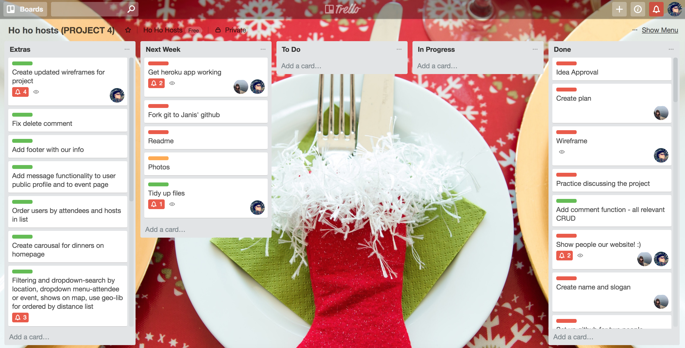
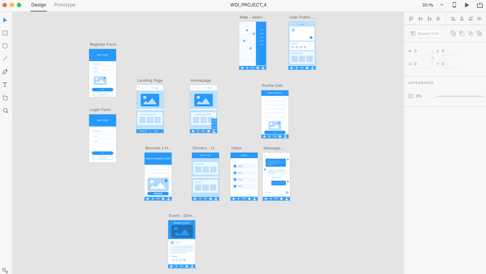
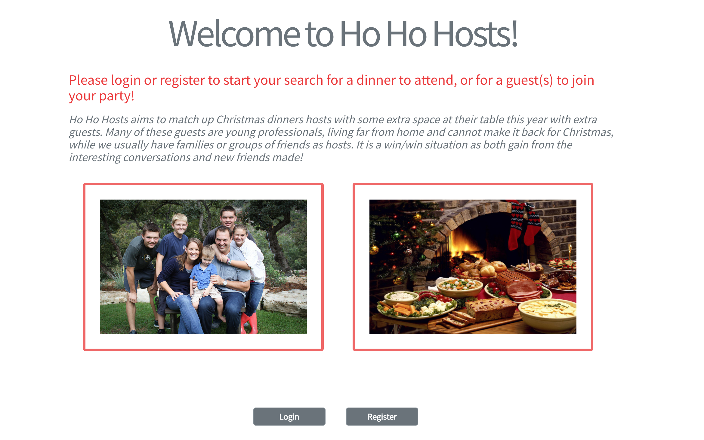
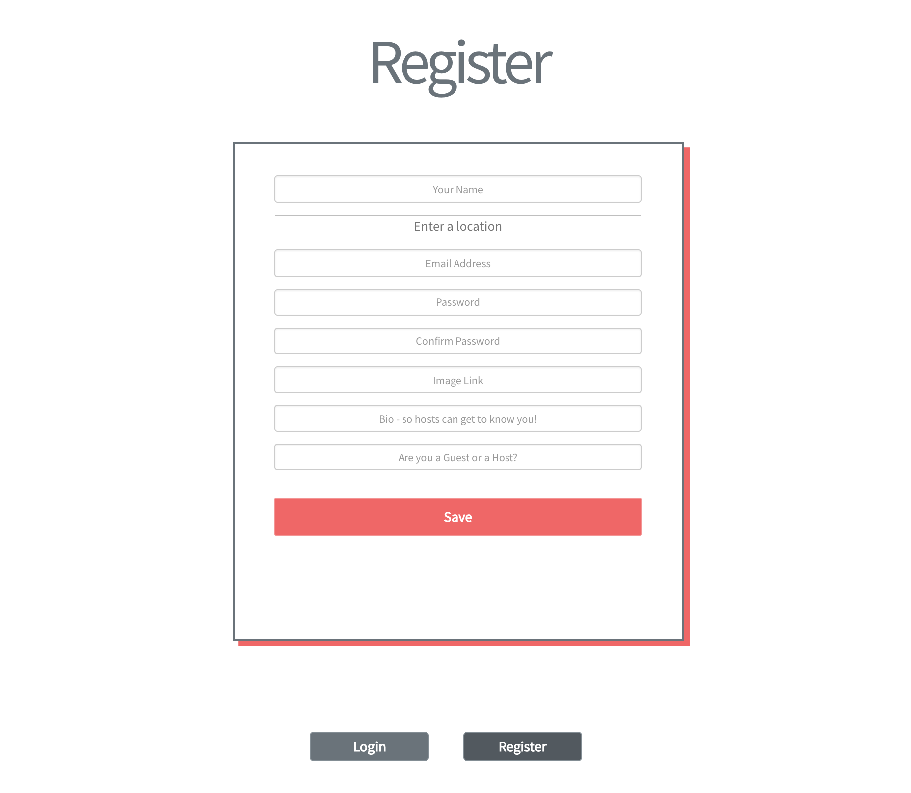
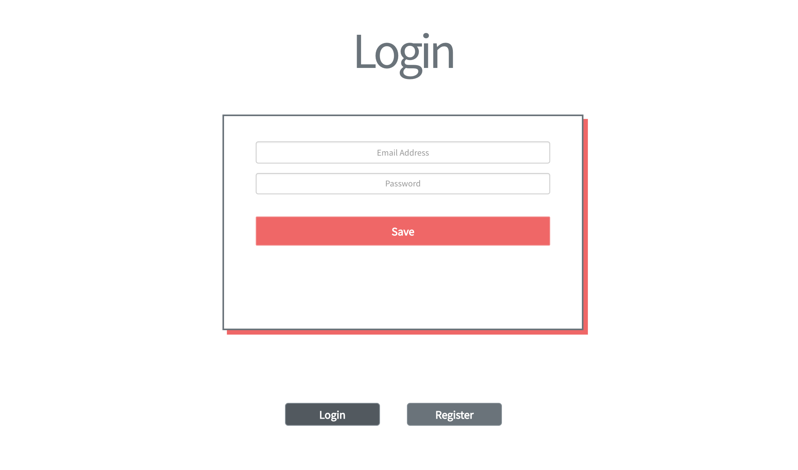
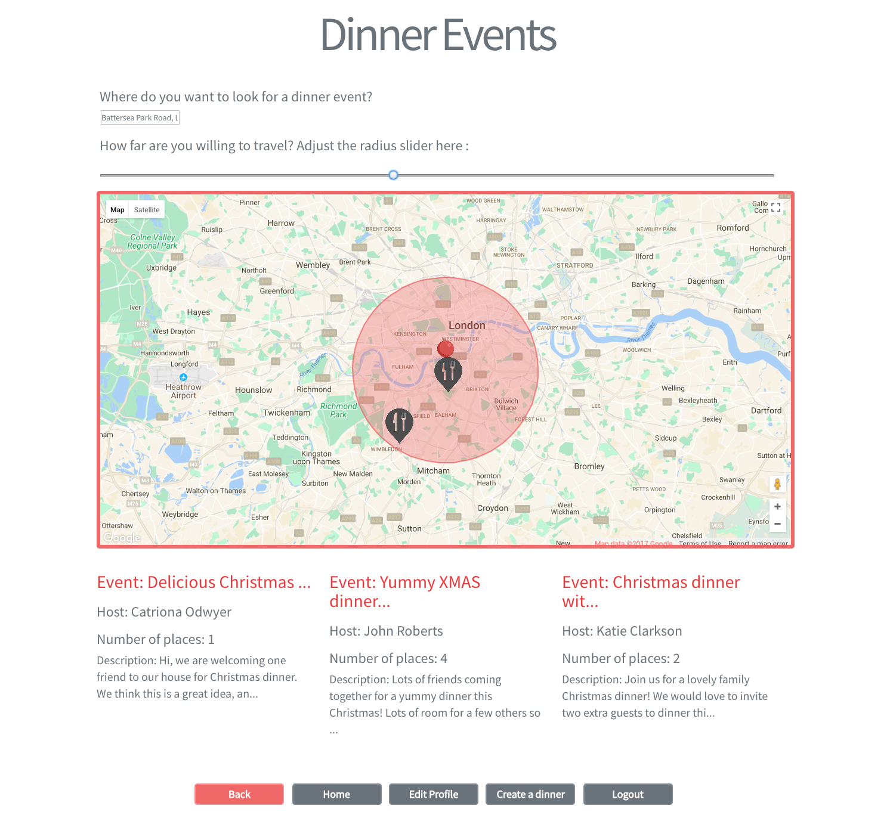
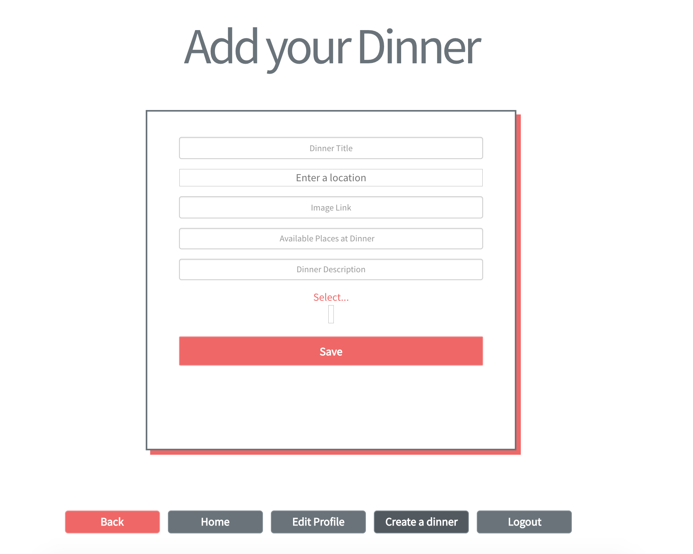
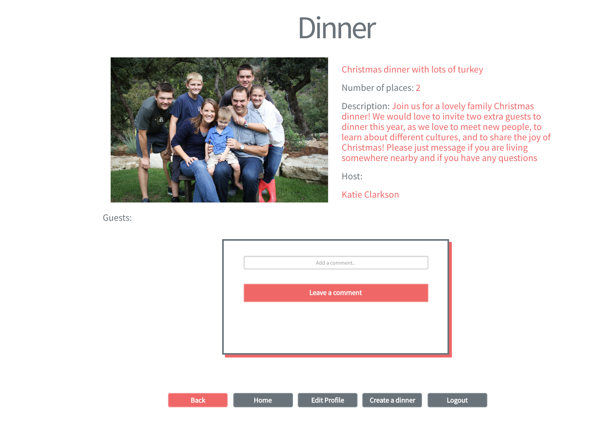
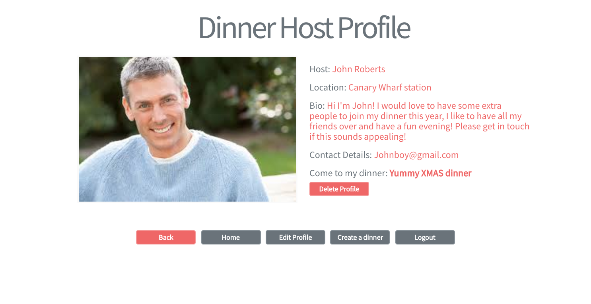
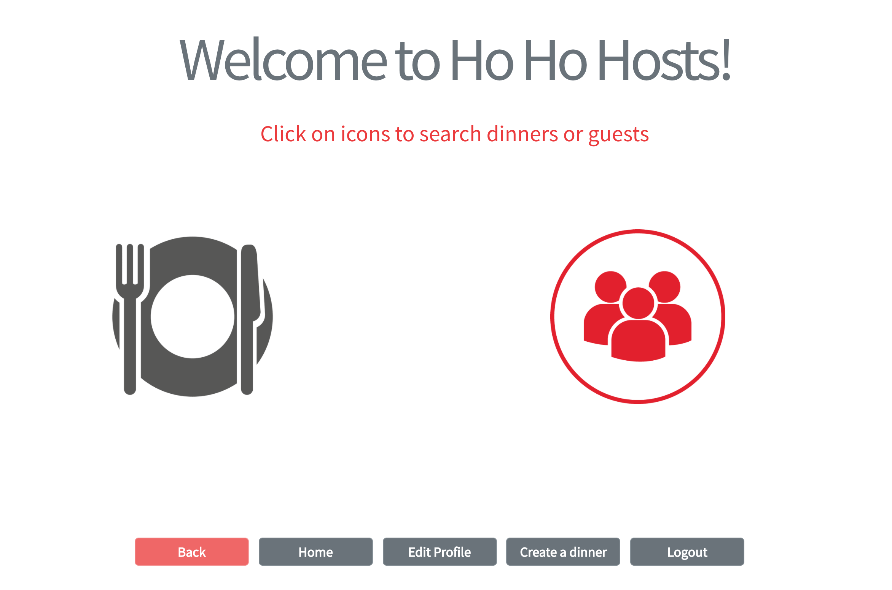

#  
# WDI PROJECT 4: Ho Ho Hosts! App

## Brief
We were set a challenge to design and build a MERN stack app. 

Technical requirements:
- Build a full-stack application
- Use an Express 4 API to serve data from Mongo database
- Consumer your API with a separate front-end built with React
- Complete product with CRUD functionality for two models
- Use of wireframes
- Deployed online
- Some automated testing of back end RESTful resource

## Technologies Used / Stack

### Server-side

- MongoDB
- Mongoose
- Node.js
- Express.js
- JavaScript
- Webpack

### Client-side

- React
- JavaScript
- HTML
- CSS
- SCSS
- Babel
- Bootstrap CSS only

### Other

- Mocha
- Chai
- GitHub
- Heroku

## Local Set-up of Dependencies

Clone or download the repository and navigate to it's root in the terminal.

- run `yarn` / `npm i`
- run `mongod`
- run `node db/seeds`
- run `yarn start:server`
- run `yarn start:client`
- Navigate to `http://localhost:8000`

## Overview

For the final project of the course, we chose to complete this as a pair. We both saw advantages of when working in a group project, however, as we were similar levels, there was an added advantage of being able to learn and code together and consolidating learning from the classes of the final module.

During planning stage of the project, we wireframed and planned as a pair on a paper before transferring the agreed content into Trello and Adobe XD.

Several weeks prior to project start, we had already discussed the idea creating an app where users can host Christmas dinner but who had spare places/seats at their table could produce a dinner event and for other attendees who were away from home over the festive holidays to be able to contact them and join them for dinner.  The idea came from the fact that we have international friends in London who sometimes have to come together to organise Christmas celebrations as other people travel home. The concept would be aimed at professionals who work in London.  We specifically decided to base the application around Christmas dinner in London as this would be scalable to other large international cities and for other dinner events/celebrations throughout the year.

Image 1: Trello Board

Image 2: Adobe XD Wireframe

Image 3: Planning

Planning together on paper was crucial to clarify the vision and user audience for app consumption.  

We broke down the work into small manageable tasks so we could split the work during project duration. The project was completed with a mix of individual and pair-programming. The added advantage of working in a pair is that it encouraged the use of branches within GitHub set-up which meant we could work and experiment with code without having to commit and merge until a function was complete and working front end.

Once the planning work was completed the output was transferred to usable packages for reference throughout remainder of project. Trello was used to review and divide tasks whilst Adobe XD was used to keep visual of initial design and layout.

## Mechanics

### Landing Page of the Website

The landing page has a short description of the application concept. The design was kept clean for clarity on a mobile or smaller device.

Image 4: Landing Page of Website Application

### Register / Login

In order to encourage user interaction, users must be registered and logged into the site to access it's full functionality. This is presented in standard form format pages where the information can be typed in and submitted.

Image 5: Register Page

Image 6: Login Page

### Searchable Dinners based on location

From a user experience perspective, people are familiar with Google Maps, therefore we used the Google map API as a large feature on the dinner event search page. Users are able to type in a location and hosted dinner events within a radius of selected location. The slider allows the radius search to change on the map with markers within radius search appearing on the page only. 

Image 7: Dinner Event Index Page

### Hosting(creating) A Dinner

Users can create a dinner event with details including available spaces. This is completed via a standard form. For user experience, the application only allows the host to manually edit which users are attending the dinner event. This is completed via the editing dinner form which has an array of users registered to add to people attending.

Image 8: Create Dinner Page

### Dinner Event

Other users that are registered can view and contact a dinner host if they are interested in attending a dinner event. With embedded referencing, a user can view a host's profile to get to know the creator of the dinner event.

Image 9: Dinner Profile Page

Image 10: Host Profile Page

### User Profile

The profile page gives the user a central page overview with their details and which dinner events they have either created or joined. This allows easy navigation upon logging into the app. In addition, the user has the ability to update and edit their own details in the application. 

Image 11: User Homepage

## Challenges

- Embedded referencing in React with User as second model/resource
- 

## Wins

We worked well as a pair and learned whilst pair programming and how different features interlink and implementing in practise.

Meeting minimum viable product and understanding when to let go of extra features due to time constraints.

Embedded referencing with React front end for better user experience through multiple links.

Google API and the various library features.

## Additional Features to Implement

- Fully mobile responsive (Use of an alternative CSS framework)

- Scale to any Dinner Event

- Uploading or drag/drop photos 

- OAuth

